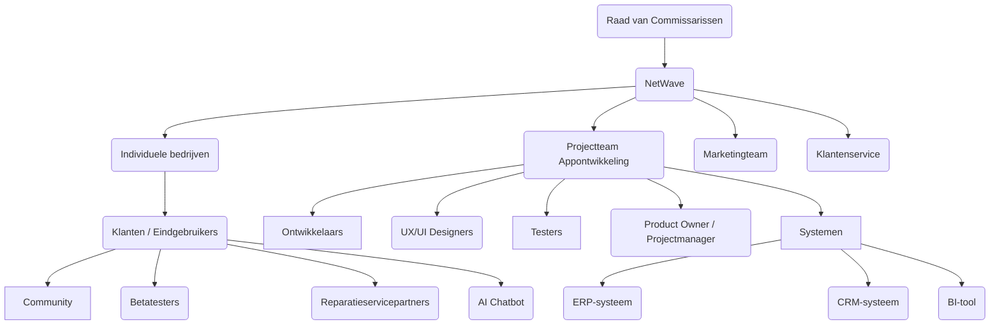
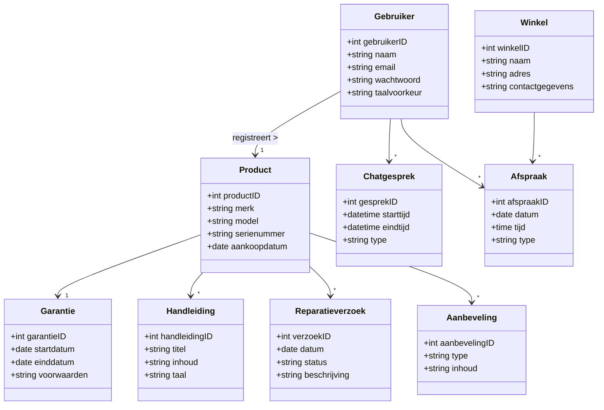

# Requirements specifcatie
##### NetWave, 2025
## Organisatorische context
### Missie

De missie van NetWave is om de smartphonemarkt te veroveren. Door gebruik te maken van geavanceerde, innovatieve en duurzame- technologieen. NetWave ontwikkelt smartphones die duurzaam en bruikbaar zijn. Bij NetWave staan wij voortdurend in verbinding met onze klanten, NetWave is gericht op de tevredenheid van hun klanten en probeert die altijd te behouden en te versterken.  

### Visie

De visie van NetWave is om de nieuwe standaard  te worden op de smartphone markt. NetWave gaat dit bereiken door voortdurend te investeren in onderzoek, ontwikkeling en marketing van onze smartphones en ons bedrijf. Ook zijn wij van plan de duurzaamste smartphones te ontwikkelen die lange tijd meegaan zonder grote impact te hebben op de natuur.


### Strategie

Dankzij marketingcampagnes willen wij de aandacht van klanten trekken, zo willen wij ervoor zorgen dat mensen ons leren kennen en een tevredenheid opbouwen. Ook willen wij bijvoorbeeld sociale media gebruiken om ons bedrijf een boost te geven met zijn bekendheid. Denk bijvoorbeeld aan TikTok of Instagram.

Klanttevredenheid speelt ook een grote rol in het groeien. Hoe tevreden de klanten hoe loyaler ze zijn. Wij willen onze klanten de beste belevenis geven bij zowel het aankopen van het product als bij het gebruik. Dat zorgt ervoor dat ze loyaal blijven en hun belevenis vertellen aan andere. 

Voor in de toekomst zijn onze plannen om ons uit te breiden naar andere landen. Voor nu weten we nog niet welke dat zijn.

Ontwikkeling campagne:
Het ontwikkelen van de campagne is belangrijk, wij willen door te investeren in kwalitatieve campagnes een sterke en herkenbare merkpositie opstellen in de markt.

Website optimalisatie:
Een geoptimaliseerde website is essentieel voor een sterke online aanwezigheid en een betere vindbaarheid in zoekmachines. Dit zorgt ervoor dat er je meer bezoekers op de website krijgt.
Een investering van 10.000 tot 25.000 euro die we doen, verdient zich op lange termijn weer terug door verbeterde ranking en hogere bezoekersaantallen.
Op dit moment kiezen wij ervoor om dit nog niet te doen. Dat komt omdat we ons meer willen focussen op de andere marketingstrategieën die direct effect hebben.


### Doelstellingen

### organogram(Actoren bij NetWave)



### Stakeholderanalyse - Applicatie van NetWave

| Stakeholder               | Type      | Belang / Doel                                                         | Invloed |
|--------------------------|-----------|------------------------------------------------------------------------|---------|
| Raad van Commissarissen  | Intern    | Initiatiefnemer. Wil klantloyaliteit en innovatie stimuleren          | Hoog    |
| PhoneVentures Management | Intern    | Stuurt het project aan en bewaakt bedrijfsbelangen                    | Hoog    |
| IT/Projectteam           | Intern    | Verantwoordelijk voor ontwerp, bouw en testen van de app              | Hoog    |
| Product Owners           | Intern    | Bepalen de functionele inhoud en prioriteiten                         | Hoog    |
| Marketingteam            | Intern    | Zorgt voor promotie, aanbiedingen en klantcommunicatie                | Middel  |
| Klantenservice           | Intern    | Wordt ondersteund/vervangen door chatbot en selfservicefuncties       | Middel  |
| Klanten / Gebruikers     | Extern    | Verwachten gebruiksgemak, informatie en service via één platform      | Hoog    |
| Reparatieservicepartners| Extern    | Behandelen meldingen, reparaties en updates                           | Laag    |
| Leveranciers van API’s  | Extern    | Leveren data, updates, vertalingen, etc.                              | Middel  |


## Actoren in NetWave

De applicatie genaamd _**Wave**_ is een innovatieve applicatie gemaakt door NetWave om de klantervaring en klantloyaliteit te verbeteren en te versterken. Hieronder zie je wie de applicatie allemaal zullen gebruiken en de bijbehorende functies ervan:

---

### 1. Klant (de gebruiker van de app)
- Registreert zijn of haar telefoon door een QR-code te scannen of serienummer in te vullen.
- Krijgt een overzicht van al zijn/haar apparaten.
- Ontvangt meldingen als er iets belangrijks gebeurt (zoals een update of garantie die afloopt).
- Kan handleidingen en video's bekijken over hoe dingen werken.
- Kan vragen stellen aan een slimme chatbot of chatten met echte medewerkers.
- Meldt een probleem of schade via de app.
- Krijgt persoonlijke aanbiedingen en kortingen.
- Doet mee aan de community: vragen stellen, antwoorden geven en reviews achterlaten.
- Maakt afspraken bij een winkel of servicepunt in de buurt voor elke situatie. 
- Past de instellingen aan zoals taal, meldingen of app-thema, zodta het gewenster is voor de klant en het de klanttevredenheid bevordert. 

---

### 2. Klantenservice medewerker
- Antwoordt op live chats van klanten.
- Belt klanten terug op een gewenst moment of indien nodig op afspraak. 
- Kijkt naar problemen voor de klant en helpt met reparaties.
- Controleert meldingen en geeft updates.
- Houdt de community netjes en helpt bij vragen.
- Registreert het in het systeem. 

---

### 3. Contentbeheerder / Marketeer
- Maakt handleidingen, video's en nieuwsberichten in de app(Wave), zodat het aantrekkelijker wordt voor de klant. 
- Zorgt voor acties, aanbiedingen en tips voor klanten, want dit trekt klanten aan en houdt ze tevreden. 
- Past de teksten aan voor verschillende talen en landen, zodat het ook daadwerkelijk voor iedereen beschikt is en niemand wordt buitengesloten. 
- Zet spelletjes en beloningen in de app (zoals achievements), om de klanten te amuseren en ze op zo'n wijze meer gebruik te laten maken van de App (Wave)
- Kijkt naar wat klanten doen en passen acties daarop aan, aan de hand van een algoritme wat wel bekende social media's al heel lang toepassen. 

---

### 4. Appbeheerder / Technisch team
- Houdt de app veilig en snel. De veiligheid zorgt ervoor dat we voldoen aan wetten en niet juridisch in de problemen komen. 
- Zorgt dat alles goed werkt en er geen fouten zijn.
- Zorgt voor updates en nieuwe functies, om het innovatief te houden en ervoor te zorgen dat bijvoorbeeld privacy inbrekingen amper voor komen. 
- Regelt koppelingen met andere systemen (zoals klantenbestand of voorraad).

---

### 5. Andere systemen die meewerken
- **ERP-systeem**: weet wat op voorraad is en hoelang de garantie duurt.
- **CRM-systeem**: houdt klantgegevens bij.
- **BI-systeem**: bekijkt wat klanten doen en wat beter kan.
- **Chatbot-systeem**: helpt klanten automatisch.
- **Notificatiesysteem**: stuurt meldingen naar gebruikers.
- **Kaart-systeem**: laat zien waar de dichtstbijzijnde winkels zijn.

---

### 6. Productmanager / Analist
- Kijkt wat klanten willen en gebruiken en dat ook mededelen met de appbeheerder en ontwikkelaar. 
- Bedenkt wat er nieuw moet komen in de app.
- Werkt samen met andere teams om de app te verbeteren.

---

### 7. Ontwikkelaar (de bouwers van de app)
- Bouwen de app en zorgen dat die werkt op elke telefoon.
- Maken nieuwe functies als dat nodig is.
- Repareren fouten en zorgen dat de app veilig is.

---

### 8. Bonusrol: Loyalty manager (extra rol, als je een beloningssysteem hebt)
- Regelt punten, kortingen of cadeaus voor trouwe klanten.
- Werkt samen met andere bedrijven voor speciale acties.

---

Aan de hand van de toegeweze rollen kan NetWave en de bijbehorende actoren ervoor zorgen dat de applicatie _**Wave**_  veilig is voor de gebruikers tegen een cybersecurity inbraak en fijn is om te gebruiken. 

## Bedrijfsproces analyse

### Ist situatie(Huidige situatie): 

* Klanten gebruiken verschillende kanalen voor ondersteuning, informatie en services.

* Beperkte integratie tussen systemen leidt tot inconsistente klantgegevens.

* Handmatige processen voor garantieclaims en reparaties zijn tijdrovend en foutgevoelig.

* Gebrek aan gepersonaliseerde communicatie en aanbiedingen.

### Soll situatie(gewenste situatie):

* Een geïntegreerde mobiele applicatie die als centraal platform dient voor alle klantinteracties.

* Automatisering van processen zoals registratie, garantieclaims en updates.

* Realtijd synchronisatie met ERP-, CRM- en BI-systemen voor consistente en actuele informatie.

* Gepersonaliseerde ervaringen door gebruik van AI en klantgegevens.

### Knelpunten

De knelpunten waarmee we kampen zijn het volgende:

* We zijn erg afhankelijk van meerdere afdelingen en systemen bij het regristreren van gegevens
* Het erg lastig en complex is om gegevens te beschermen op het gebied van beveiliging en het waarbogren van en voldoen aan de privacy wetregelgeving
* Ten slotte kunnen klanten minder interesse hebben in het nieuwe platform, omdat ze zich niet willen aanpassen eraan.

### Gapp analyse(Het verschil)

Uit de gap-analyse blijkt dat er een grote verschil blijkt tussen de ist en soll situatie op de volgende gebieden: klantenservice, communicatie, informatievoorziening, de betrokkenheid en data-analyse. Het blijkt zo te zijn dat in het huidige proces veel dingen handmatig worden gedaan en niet goed samenhangend zijn. Dit leidt tot problemen zoals dat processen inefficiënt verlopen, wat als gevolgd de klanttevredenheid kan benadelen. 

Voor het gewenste situatie(soll) hoort een passend geïntegreerd systeem dat ervoor zorgt dat de processen gecentraliseerd en geautomiseerd worden. DIt zal de ineffecienties verhelpen en ervoor zorgen dat het gehele proces meer samenhangend is met elkaar. Om dit te bereiken moet er geïnvesteerd worden in technologie, training voor de bijbehorende actoren en dat het management aangepast worden voor het gewenste sitatie. Dit zal er naar leiden dat de bijbehorende actoren zowel op de technologische als op de vlakken van menselijke kant, zoals vaardigheden en kennis goed toegepast kunnen worden. 

## Product visie


## Domeinmodel
### 📘 Domeinmodel PhoneVentures App

```mermaid
erDiagram
    KLANT ||--o{ PRODUCT : registreert
    KLANT ||--o{ GARANTIE : heeft
    KLANT ||--o{ REPARATIE : meldt
    KLANT ||--o{ FEEDBACK : geeft
    KLANT ||--o{ COMMUNITY_POST : schrijft
    KLANT ||--o{ CHATGESPREK : start
    KLANT ||--o{ INSTELLING : heeft
    KLANT ||--o{ NOTIFICATIE : ontvangt
    KLANT ||--o{ TAALOPTIE : gebruikt

    PRODUCT ||--|{ HANDLEIDING : bevat
    PRODUCT ||--|{ TUTORIAL : bevat
    PRODUCT ||--o{ SOFTWARE_UPDATE : ontvangt
    PRODUCT ||--o{ AANBEVELING : krijgt

    GARANTIE }|--|| VERLENGING : heeft_optie_op
    GARANTIE }|--|| VERZEKERING : heeft_optie_op

    REPARATIE ||--|{ TRACKING : heeft
    REPARATIE ||--o{ MEDIA_UPLOAD : bevat

    CHATGESPREK ||--o{ CHATBERICHT : bevat
    CHATGESPREK ||--o{ MEDEWERKER : met

    COMMUNITY_POST ||--|{ REACTIE : heeft
    COMMUNITY_POST ||--o{ BADGE : verdient

    AANBEVELING ||--|| ACCESSOIRE : betreft

    LOCATIE ||--o{ WINKEL : heeft
    LOCATIE ||--o{ SERVICECENTRUM : heeft

    KLANT {
        int klantID
        string naam
        string email
        string wachtwoord
        date geboortedatum
    }

    PRODUCT {
        int productID
        string merk
        string model
        string serienummer
        string IMEI
        date aankoopdatum
        string softwareversie
    }

    GARANTIE {
        int garantieID
        date startdatum
        date einddatum
    }

    VERLENGING {
        int verlengingID
        date nieuweEinddatum
    }

    VERZEKERING {
        int verzekeringID
        string type
        float premie
    }

    HANDLEIDING {
        int handleidingID
        string titel
        string taal
        text inhoud
    }

    TUTORIAL {
        int tutorialID
        string titel
        string videolink
        string taal
    }

    SOFTWARE_UPDATE {
        int updateID
        string versie
        string changelog
        date releasedatum
    }

    REPARATIE {
        int reparatieID
        string status
        date meldingDatum
        string probleemomschrijving
    }

    MEDIA_UPLOAD {
        int uploadID
        string bestandstype
        string bestandslocatie
    }

    TRACKING {
        int trackingID
        string status
        date updateDatum
        string opmerking
    }

    CHATGESPREK {
        int gesprekID
        datetime starttijd
    }

    CHATBERICHT {
        int berichtID
        datetime verzendtijd
        string inhoud
    }

    MEDEWERKER {
        int medewerkerID
        string naam
        string afdeling
    }

    FEEDBACK {
        int feedbackID
        int score
        text opmerking
    }

    COMMUNITY_POST {
        int postID
        string titel
        text inhoud
        datetime datum
    }

    REACTIE {
        int reactieID
        text inhoud
        datetime datum
    }

    BADGE {
        int badgeID
        string naam
        string omschrijving
    }

    AANBEVELING {
        int aanbevelingID
        string type
        string promotietekst
    }

    ACCESSOIRE {
        int accessoireID
        string naam
        string beschrijving
        float prijs
    }

    LOCATIE {
        int locatieID
        string stad
        string adres
    }

    WINKEL {
        int winkelID
        string naam
        string openingstijden
    }

    SERVICECENTRUM {
        int centrumID
        string naam
        string openingstijden
    }

    INSTELLING {
        int instellingID
        bool notificatiesAan
        string thema
        bool donkereMode
    }

    NOTIFICATIE {
        int notificatieID
        string titel
        string inhoud
        datetime verzondenOp
    }

    TAALOPTIE {
        int taalID
        string taal
    }
```




## Uml-klassendiagram




## Sitemap

```mermaid
graph TD
    A[Home / Dashboard] --> B[Productregistratie]
    A --> C[Mijn Producten]
    C --> C1[Productdetails]
    C1 --> C1a[Garantie & Verzekering]
    C1 --> C1b[Softwareversies]
    C1 --> C1c[Specificaties]

    A --> D[Updates & Notificaties]
    D --> D1[Pushberichten]
    D --> D2[Beta-updates]
    
    A --> E[Handleidingen & Tutorials]
    E --> E1[Zoekfunctie]
    E --> E2[Interactieve Video's]
    E --> E3[Tips & Tricks]

    A --> F[Garantie & Reparatie]
    F --> F1[Reparatie aanvragen]
    F --> F2[Foto's / Video upload]
    F --> F3[Status tracking]

    A --> G[AI Chatbot & Live Support]
    G --> G1[AI Chatbot (24/7)]
    G --> G2[Live Chat]
    G --> G3[Terugbelfunctie]

    A --> H[Communityforum]
    H --> H1[Vragen & Antwoorden]
    H --> H2[Tips delen]
    H --> H3[Badges & Rankings]

    A --> I[Aanbiedingen & Aanbevelingen]
    I --> I1[Accessoires]
    I --> I2[Exclusieve kortingen]
    I --> I3[Productlanceringen]

    A --> J[Winkelzoeker & Afspraken]
    J --> J1[Zoek op locatie]
    J --> J2[Afspraken maken]
    J --> J3[Evenementen]

    A --> K[Instellingen]
    K --> K1[Privacy-instellingen]
    K --> K2[Notificatievoorkeuren]
    K --> K3[Taal & Thema]

    A --> L[Account]
    L --> L1[Profiel]
    L --> L2[Communicatievoorkeuren]
    L --> L3[Feedback & Reviews]
```

## Wireframes


